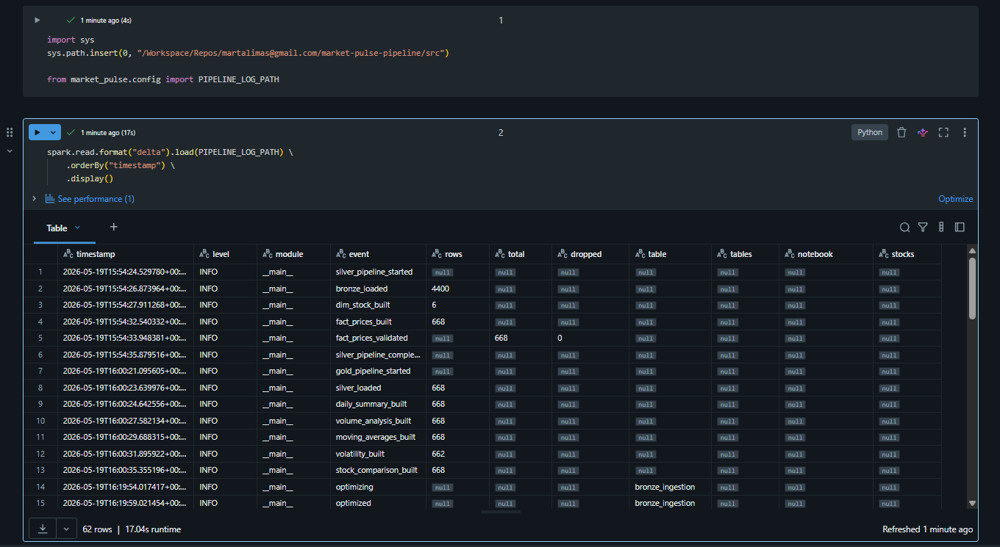
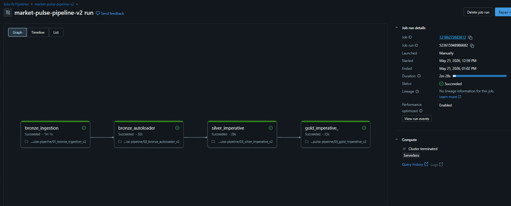
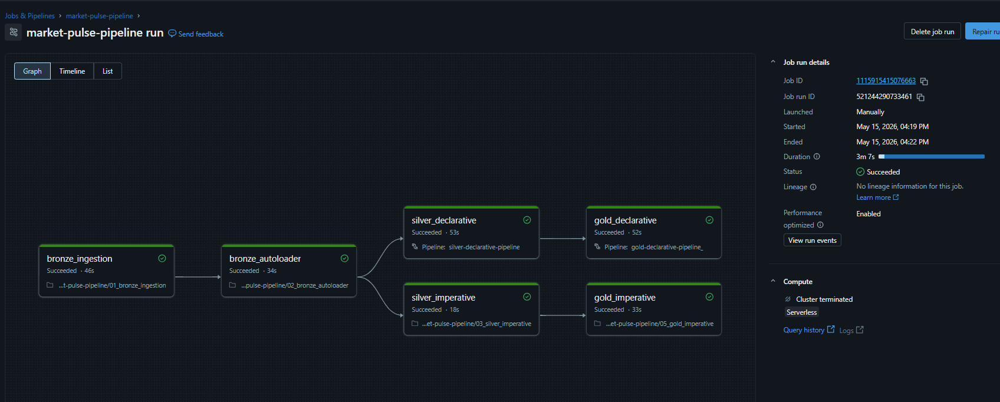
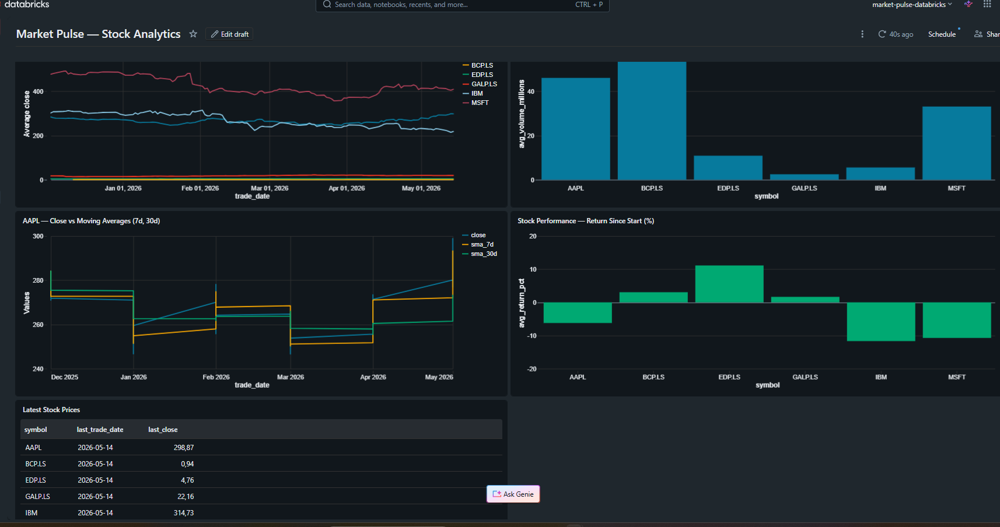

# Market Pulse Pipeline


End-to-end financial data pipeline using **Azure Databricks**, **Delta Lake** and an **Enhanced Medallion Architecture** — built with production engineering practices: SOLID code structure, unit tests, structured observability, automated maintenance and robust error handling.

**Repository:** [github.com/martalimas/market-pulse-pipeline](https://github.com/martalimas/market-pulse-pipeline)
**Status:** ✅ Stage 3 — Production Hardening complete · 🔧 Stage 4 — DataOps next

---

## Objective

Build a production-ready data pipeline that ingests real-world stock market data through three distinct ingestion patterns (batch, micro-batch, streaming), processes it through the Medallion architecture, and exposes analytical metrics through a live dashboard.

The project deliberately demonstrates **the evolution of a real data engineering project**:

- Both **imperative** (PySpark) and **declarative** (DLT) approaches, side by side.
- The progression from **batch → incremental → streaming** ingestion.
- The refactor from **prototype notebooks** to a **SOLID, tested, observable Python codebase** — mirroring how a project matures in industry.

---

## High-level Architecture

```
┌─────────────────────────────────────────────────────────────┐
│                        SOURCES                              │
│                                                             │
│  BATCH        Alpha Vantage API → manual ingestion     ✅   │
│  MICRO-BATCH  Auto Loader → incremental JSON files     ✅   │
│  STREAMING    Python producer → Azure Event Hubs       ⚠️   │
│               Azure Function (timer trigger)           ⏳   │
│                                                             │
└───────────────────────┬─────────────────────────────────────┘
                        │
                        ▼
┌─────────────────────────────────────────────────────────────┐
│                   ADLS Gen2 (Data Lake)                     │
│                                                             │
│  /bronze/stocks/         ← Bronze Landing (JSON raw)   ✅   │
│  /bronze/ingestion/      ← Bronze Ingestion (Delta)    ✅   │
│  /bronze/streaming/      ← Event Hubs stream target    ⚠️   │
│  /silver/                ← Silver layer                ✅   │
│  /gold/                  ← Gold layer                  ✅   │
│  /observability/         ← Structured pipeline logs    ✅   │
│                                                             │
└───────────────────────┬─────────────────────────────────────┘
                        │
                        ▼
┌─────────────────────────────────────────────────────────────┐
│                AZURE DATABRICKS                             │
│                                                             │
│  BRONZE LANDING    Raw JSON files (immutable, partitioned)  │
│        ↓           01_bronze_ingestion                 ✅   │
│                                                             │
│  BRONZE INGESTION  Flattened Delta table                    │
│        ↓           02_bronze_autoloader (Auto Loader)  ✅   │
│                    Incremental append + checkpoint          │
│                    + schema enforcement                     │
│                                                             │
│  SILVER            Typed · Deduplicated · Validated         │
│        ↓           Imperative (PySpark)                ✅   │
│                    Declarative (DLT + Expectations)    ✅   │
│                                                             │
│  GOLD              Analytical metrics (5)                   │
│                    Imperative (PySpark + Spark SQL)    ✅   │
│                    Declarative (DLT)                   ✅   │
│                                                             │
│  Orchestration: Lakeflow Jobs (v1, v2-SOLID, maint.)   ✅   │
│  Observability: Structured JSON logs → Delta table     ✅   │
│                                                             │
└───────────────────────┬─────────────────────────────────────┘
                        │
                        ▼
┌─────────────────────────────────────────────────────────────┐
│                  VISUALIZATION                              │
│  Databricks SQL Dashboard — 5 widgets                  ✅   │
└─────────────────────────────────────────────────────────────┘
```

---

## Tech Stack

| Service | Role | Tier | Status |
|---|---|---|---|
| **Azure ADLS Gen2** | Central Data Lake storage | Standard LRS | ✅ |
| **Azure Databricks** | Processing engine + Medallion | Premium + Serverless | ✅ |
| **Azure Key Vault** | Secure secret storage | Standard | ✅ |
| **Azure Event Hubs** | Streaming ingestion | Basic | ⚠️ |
| **Azure Function** | Automated API caller | Consumption | ⏳ |
| **GitHub** | Version control | Free | ✅ |
| **pytest** | Unit testing | — | ✅ |
| **tenacity** | Retry / backoff | — | ✅ |

---

## Data Source

**Alpha Vantage API**

- **URL:** [alphavantage.co](https://www.alphavantage.co)
- **Plan:** Free (25 requests/day, 5/minute)
- **Endpoints used:**
  - `TIME_SERIES_DAILY` — daily OHLCV history (compact: last 100 days)
  - `GLOBAL_QUOTE` — real-time quote (Event Hubs streaming)
- **Tracked stocks:** `AAPL`, `MSFT`, `IBM`, `EDP.LS`, `GALP.LS`, `BCP.LS`
  - Mix of US tech and Portuguese stocks (Euronext Lisbon)
  - Configurable via `config/alpha_vantage_schema.json`

---

## Code Architecture — SOLID `src/` package

In Stage 3, all business logic was extracted from prototype notebooks into a tested, reusable Python package following the **Single Responsibility Principle**. Each module does one thing.

```
src/market_pulse/
├── config.py                  ← all paths, constants, Key Vault config
├── utils.py                   ← write_delta_table (generic Delta writer)
├── logger.py                  ← StructuredLogger + get_logger factory
├── ingestion/
│   ├── api.py                 ← fetch_stock (HTTP only, tenacity retry)
│   ├── storage.py             ← save_to_bronze (Databricks + Azure SDK)
│   └── orchestrator.py        ← ingest_all_stocks (coordinates api + storage)
├── bronze/
│   ├── schema.py              ← Alpha Vantage JSON schema (MapType)
│   └── transformations.py     ← process_batch (foreachBatch flatten)
├── silver/
│   ├── transformations.py     ← read_bronze, build_dim_stock, build_fact_prices
│   └── validation.py          ← validate_dim_stock, validate_fact_prices
└── gold/
    └── metrics.py             ← 5 Gold metric builders
```

**The notebooks became thin orchestration layers** (`*_v2`) that import from `src/`. The original notebooks are kept as a record of the project's evolution — prototype to production.

---

## Medallion Layers

### Bronze Landing
- Raw JSON files exactly as returned by the Alpha Vantage API
- Append-only — files are never modified or deleted
- Partitioned by `ingest_date=YYYY-MM-DD`
- Format: JSON

### Bronze Ingestion
- Flattened Delta table built incrementally from Bronze Landing
- **Stage 1:** Full overwrite batch (`02_bronze_to_ingestion`)
- **Stage 2:** Auto Loader micro-batch (`02_bronze_autoloader`) — checkpoint-based, processes only new files
- **Schema enforcement** — `failOnNewColumns` + `inferColumnTypes=false`: the pipeline fails fast on unexpected fields instead of propagating corrupt data
- All fields kept as `STRING` — type casting delegated to Silver
- Non-flat JSON (Alpha Vantage `Time Series (Daily)` uses dynamic date keys) — handled via `foreachBatch` + `explode(MapType)`

### Silver
- Type casting: `trade_date` → DateType, prices → DoubleType, volume → LongType
- Deduplication on `(symbol, trade_date)`
- Data Quality Expectations (DLT) / validation functions (imperative):
  - `open > 0`, `high > 0`, `low > 0`, `close > 0`
  - `volume >= 0`, `symbol IS NOT NULL`
- Two tables: `dim_stock` (one row per symbol), `fact_prices` (one row per `symbol × trade_date`)
- Two implementations: Imperative (PySpark) + Declarative (DLT)

### Gold
- `daily_summary` — daily return %, intraday range
- `moving_averages` — 7-day and 30-day SMA with bullish/bearish signal
- `volatility` — rolling 7d/30d standard deviation of daily returns
- `volume_analysis` — 30d rolling average, volume vs avg %, high-volume flag
- `stock_comparison` — cumulative return since start, daily rank across stocks
- Two implementations: Imperative (PySpark + Spark SQL) + Declarative (DLT)

---

## Ingestion Patterns — Evolution

| Pattern | Notebook | Trigger | Behaviour |
|---|---|---|---|
| Batch | `02_bronze_to_ingestion` | Manual | Reads ALL files, full overwrite |
| Micro-batch | `02_bronze_autoloader` | Manual / Job | Reads only NEW files, append |
| Streaming | `07_bronze_streaming_eventhubs` | Job / continuous | Real-time via Event Hubs |

The migration from batch to Auto Loader required rewriting the transformation from Python `parse_file()` to Spark-native `explode(MapType)` — documented in `docs/02_bronze_autoloader_doc.md`.

---

## Observability & Structured Logging

Every pipeline run emits **structured JSON logs** that are both printed to the notebook output and persisted to a **Delta audit table** in a dedicated `observability` container.

```python
logger.info("dim_stock_built", rows=6)
# → {"timestamp": "...", "level": "INFO", "module": "market_pulse.silver.transformations",
#    "event": "dim_stock_built", "rows": 6}
```

The audit table makes the pipeline **queryable**:

```sql
-- How many rows were dropped during validation today?
SELECT event, total, dropped
FROM delta.`abfss://observability@.../pipeline_logs/`
WHERE event = 'fact_prices_validated'
  AND DATE(timestamp) = CURRENT_DATE()
```

A typical run logs ~13 events end to end (pipeline start/complete, rows loaded/built per layer, rows dropped in validation), giving full visibility into what ran, when, and how much data moved.


*Structured logs persisted to the observability Delta table — rows loaded, built and validated per layer.*

---

## Testing

Unit tests with **pytest**, using mocks (no live API calls) and a Databricks-compatible Spark fixture.

```
tests/
├── conftest.py                ← fixtures (sample API responses, Spark session)
├── test_bronze_ingestion.py   ← fetch_stock: success + invalid symbol
├── test_silver.py             ← dim/fact build + validation drops
└── test_gold.py               ← daily_summary columns, return calc, zero-open guard
```

9 tests covering the core logic of every layer.

---

## Error Handling — Retry with Backoff

API calls use **tenacity** with exponential backoff and typed exceptions:

- `RateLimitError` → **retryable** (3 attempts, waits 1s → 2s → 4s)
- `InvalidSymbolError` → **not retryable** (fails immediately — retrying an invalid ticker is pointless)

```python
@retry(
    retry=retry_if_exception_type(RateLimitError),
    stop=stop_after_attempt(3),
    wait=wait_exponential(multiplier=1, min=1, max=8),
)
def fetch_stock(symbol, api_key): ...
```

Documented in `docs/error_handling_retry.md`.

---

## Orchestration — Lakeflow Jobs

Three jobs run the platform:

| Job | Purpose | Schedule |
|---|---|---|
| `market-pulse-pipeline` | v1 — imperative + DLT (feeds the dashboard) | Manual / scheduled |
| `market-pulse-pipeline-v2` | Stage 3 — SOLID, imports from `src/` | Manual / scheduled |
| `market-pulse-maintenance` | OPTIMIZE + Z-ORDER on all Delta tables | Weekly (Sun 02:00) |

**v2 DAG:** `bronze_ingestion → bronze_autoloader → silver_imperative → gold_imperative`
Full pipeline completes in ~3 minutes on Serverless compute.


*The v2 (SOLID) pipeline running end to end on Serverless.*

### Maintenance job
`08_maintenance` runs `OPTIMIZE` + `ZORDER BY (symbol, trade_date)` across all 8 Delta tables to compact small files and co-locate frequently filtered data. Results are logged to the observability table as a maintenance report.


*The v1 pipeline showing imperative and declarative (DLT) paths side by side.*

---

## Technical Decisions & Limitations

### Auto Loader — `foreachBatch` pattern
The Alpha Vantage JSON uses dynamic date keys in `Time Series (Daily)`, making it a `MapType` in Spark. Direct streaming transformations on nested structs with special characters are unsupported in Serverless. Solution: `foreachBatch` processes each micro-batch as a standard batch DataFrame with full API access.

### Event Hubs — Serverless networking limitation
Serverless compute has restricted outbound network access. The Kafka endpoint (port 9093) is unreachable from Serverless clusters. In production this would run on a Classic cluster or with VNet injection. Code is implemented and correct — the limitation is infrastructure, not logic.

### Streaming trigger — `availableNow` vs `processingTime`
Serverless does not support continuous streaming triggers (`processingTime`). All streaming uses `availableNow=True` (micro-batch). True continuous streaming requires a Classic cluster.

### `write_delta_table` — generic by mechanism, not by policy
The shared writer handles the *how* (Delta format, mode, partitioning); the *what* and the write mode (`overwrite` vs `append`) are decided by each calling layer. This keeps `utils.py` free of business logic.

---

## Repository Structure

```
market-pulse-pipeline/
├── README.md
├── requirements.txt                    ← tenacity, pyspark, requests, azure SDKs
├── pytest.ini
├── config/
│   └── alpha_vantage_schema.json       ← metadata-driven field mapping
├── docs/
│   ├── ROADMAP.md
│   ├── infrastructure_setup.md
│   ├── architecture_decisions.md
│   ├── 02_bronze_autoloader_doc.md     ← Auto Loader design + migration
│   ├── 07_bronze_streaming_eventhubs_doc.md ← Event Hubs + Serverless limits
│   └── error_handling_retry.md         ← retry / backoff patterns
├── src/market_pulse/                   ← SOLID package (see Code Architecture)
│   ├── config.py · utils.py · logger.py
│   ├── ingestion/ · bronze/ · silver/ · gold/
├── tests/                              ← pytest suite (9 tests)
├── azure_function/                     ← Azure Function (code complete, no deploy)
├── 01_bronze_ingestion        + _v2    ← API → Bronze Landing
├── 02_bronze_autoloader       + _v2    ← Auto Loader micro-batch
├── 02_bronze_to_ingestion              ← Batch ingestion (Stage 1, reference)
├── 03_silver_imperative       + _v2    ← Silver PySpark
├── 04_silver_declarative.py            ← Silver DLT
├── 05_gold_imperative         + _v2    ← Gold PySpark + Spark SQL
├── 06_gold_declarative.py              ← Gold DLT
├── 07_bronze_streaming_eventhubs       ← Event Hubs streaming
├── 08_maintenance                      ← OPTIMIZE + Z-ORDER (weekly)
├── 09_scd_type2                        ← SCD Type 2 with MERGE (Stage 5)
├── 10_time_travel                      ← Delta Lake Time Travel (Stage 5)
└── connection-test                     ← ADLS connectivity test
```

> Note: `*_v2` notebooks are the Stage 3 thin orchestration layers importing from `src/`. The originals are kept to show the prototype-to-production evolution.

---

## Security

- API keys and connection strings stored in **Azure Key Vault** (`mktpulse-kv`)
- Accessed via **Databricks Secret Scope** (`market-pulse-secrets`)
- Storage credentials managed via **Access Connector** (managed identity — no keys in code)
- No secrets committed to the repository

---

## Setup

For infrastructure setup: [`docs/infrastructure_setup.md`](docs/infrastructure_setup.md)
For staged roadmap and progress: [`docs/ROADMAP.md`](docs/ROADMAP.md)
For architectural decisions: [`docs/architecture_decisions.md`](docs/architecture_decisions.md)

---

## Project Status

```
✅ Stage 0 — Infrastructure Setup
   Azure ADLS Gen2, Databricks Premium, Key Vault, Access Connector

✅ Stage 1 — Functional MVP
   Bronze Landing + Ingestion (batch, metadata-driven)
   Silver (imperative + DLT, dedup, expectations)
   Gold (imperative + DLT, 5 metrics)
   Unity Catalog schemas

✅ Stage 2 — Multi-source Ingestion & Automation
   ✅ Auto Loader micro-batch (incremental Bronze ingestion)
   ✅ Lakeflow Jobs (end-to-end DAG, 3min runtime)
   ✅ Databricks SQL Dashboard (5 widgets, live)
   ⚠️  Event Hubs streaming (code complete, Serverless network limitation)
   ⏳  Azure Function (code complete, Free Trial deploy limitation)

✅ Stage 3 — Production Hardening
   ✅ SOLID src/market_pulse package (Single Responsibility)
   ✅ Thin v2 orchestration notebooks
   ✅ pytest suite (9 tests, mocked)
   ✅ Schema enforcement (failOnNewColumns)
   ✅ Structured JSON logging → Delta observability table
   ✅ OPTIMIZE + Z-ORDER weekly maintenance job
   ✅ Robust error handling (tenacity, typed exceptions, backoff)

🔧 Stage 4 — DataOps & CI/CD
   GitHub Actions (run pytest on push), Docker, scheduling, monitoring, dev/prod

🔧 Stage 5 — Advanced Patterns
   ✅ SCD Type 2 (MERGE-based historization on enriched dim_stock)
   ✅ Delta Time Travel (version queries, table history)
   ⏳ RSI, ML integration, dbt
```

---

## Dashboard

Live dashboard built in Databricks SQL — 5 visualizations:
- Stock closing prices daily evolution (6 stocks)
- AAPL close vs moving averages (7d, 30d)
- Average daily volume by stock
- Stock performance — return since start (%)
- Latest stock prices table



🔗 [View Dashboard](https://adb-7405604908512990.10.azuredatabricks.net/dashboardsv3/01f150831ad81008a4631c4b52601185/published?o=7405604908512990)


---

*Built as a portfolio project demonstrating end-to-end data engineering on Azure Databricks.*
*Stack: Azure ADLS Gen2 · Databricks Premium Serverless · Delta Lake · DLT · Lakeflow Jobs · Event Hubs · Key Vault · pytest · tenacity*
*Last updated: May 2026*
